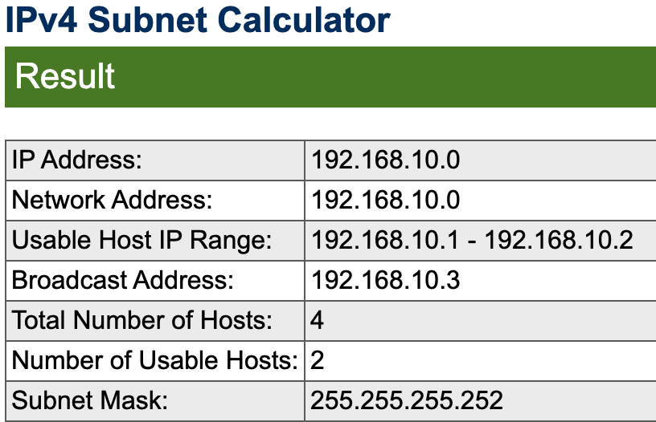
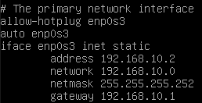
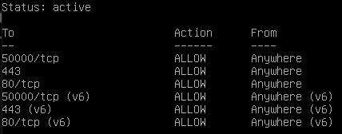
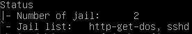
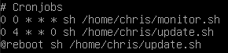
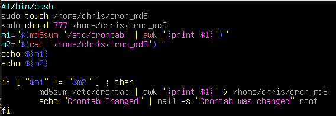
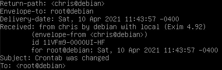
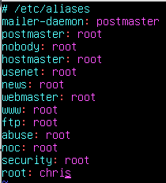

# Roger Skyline-1
**DISCLAIMER: This sysadmin stuff isn't for me. I'm only doing the required portion of this project which is just the Network and Security Part**

The goal of my writing for this project is to be as thorough as possible so that any uncertainty can be addressed right here in this readme vs you having to check additional sources. 

**Pay attention to the creation date of this file. When you're reading it, requirements may have changed!**
## Initial Preparation
Before you proceed, you need to install a few tools to help with the steps up to configuring a static IP.
* sudo
* vim  

Log into SU
```
su
```
* Update and upgrade
```
apt-get update -y && apt-get upgrade -y
apt-get install sudo vim -y
```
# Network and Security Part

##	You must create a non-root user to connect to the machine and work.

* This was done during the setup of the VM.
##	Use sudo, with this user, to be able to perform operations requiring special rights.

* Type
```
sudo usermod -aG sudo [username]
```
* Verify
```
getent group sudo
```
	
## We don’t want you to use the DHCP service of your machine. You’ve got to configure it to have a static IP and a Netmask in /30.  
I had a big headache with this one. I wanted to keep my macbook connected to the internet at the same time have my virtual machine be able to ping google. I don't know if this is the pro way of doing it, but alas, it worked for me.   

Bear in mind you'll need additional tools going forward so being able to connect to the internet is necessary. If you're unable to at this point, and still want to proceed, you can revert back to DHCP for the time being to get the necessary tools.

## Choosing your static IP address
It's fun to just randomly pick a static IP to use such as 192.168.10.42 to please the 42 gods, however I didn't find that route so easy and I certainly couldn't ping an outside source.
* Find out what your router's IP address is. You can find this (on a mac) via Preferences >> Network >> Have your wi-fi selected on the left, then click Advanced >> TCP/IP. 
* Go here: https://www.calculator.net/ip-subnet-calculator.html and enter your router's IP address while ensuring you're selecting a subnect mask of /30.   
**NOTE!!:** You want to make sure that the `Usable Host IP Range` from that page includes your router's IP address. The other IP address in that range will be your new static IP address.
* Copy the information over to your `/etc/network/interfaces` file accordingly. Here are two screenshots of what mine setup is.
 

* Save the file
* Configure your VirtualBox Network Tab accordingly
	* While having the correct Virtual Machine selected, choose settings.
	* Click Network
	* For adapter 1, changed the `attached to` to Bridged Adapter. My Bridged Adapter (en0) is set to wireless.
	* Click on Advanced
	* Set `Promiscuous Mode` to Allow All
	* Click Ok

* Back in Debian, restart your network
```
sudo service networking restart
```
* Then verify the change has taken effect
```
sudo ifconfig
```
* Trying pinging google
```
ping google.com
```
You should see activity (hopefully).
* The `auto enp0s3` is necessary to get your adapter to turn back on automatically when you restart your networking services. If you didn't use that, you'd have to use `sudo ifup enp0s3`
## You have to change the default port of the SSH service by the one of your choice. SSH access HAS TO be done with publickeys. SSH root access SHOULD NOT be allowed directly, but with a user who can be root.

### Changing the Port  
* Alter the port number within this file
```
sudo vim /etc/ssh/sshd_config
``` 
**NOTE! Make sure you're editing the SSHD_config file and not SSH_config.**

### Adding a public key

* On your host machine, generate a new key pair  
```
ssh-keygen
```   
**If you already use id_rsa.pub, DO NOT override it with a new pair**  

* This is a side step if you've given your keypair a specific name. You MUST add it to the list of keys your host will use to authenticate against the VM. Otherwise it won't find it during authentication.
	* Turn on ssh-agent
	```
	eval $(ssh-agent)
	```
	* Add your keyname (PRIVATE KEY, not .pub) to the agent
	```
	ssh-add private_key_name
	```

* Copy the new key to your VM  
```
ssh-copy-id -i ~/.ssh/your_key_name.pub hostname@ip_address -p port_nbr
```  
You'll be prompted to enter the user's password that you're logging into on the VM.
### Allow access only via SSH keys and prevent root access
* To disable ssh root login, in the  
 `/etc/ssh/sshd_config`  file, ensure the following exists and that it is **NOT** commented out:  
 ```
 PermitRootLogin no
 ``` 
* Now you need to disable all login attempts that do not strictly use the ssh key. In your `/etc/ssh/sshd_config` file, uncomment the following and set them accordingly:  
```
PubKeyAuthentication yes
PasswordAuthentication no  
ChallengeResponseAuthentication no
```
* Restart SSH service:  
```
sudo service ssh restart
```  
The reason we set those three variables is to prevent any further logging in to the VM without ssh keys. If you didn't set them, your password would/could still be used which would be pointless for this excercise.  

I believe this is the proper way to do this. For security reasons, you wouldn't want anyone to be able to ssh-copy-id into your machine. The proper way to do this would have been telling your client (in this case the host computer) to generate their ssh keys and send you the public one. You would then append it into the `authorized_keys` file in `~/.ssh/`
## You have to set the rules of your firewall on your server only with the services used outside the VM.
* If you haven't done so already, install uncomplicated firewall (ufw) and check the status. At this point, it should just show that your firewall is currently inactive. 
```
sudo apt-get install ufw -y
sudo ufw status
```

* Enable the service
```
sudo ufw enable
```  
* Now you should see that it's active but there won't be anything populated. You can see a list of services by  
`cat /etc/services` or `less /etc/services`  
We want to allow:  
	* ssh
	* http
	* https  

* Type the following commands. I've added comments to show what they're doing 
```
# Allowing SSH - port is our custom port nbr
sudo ufw allow 50000/tcp
# Allowing HTTP
sudo ufw allow 80/tcp
# Allowing HTTPS
sudo ufw allow 443
```
Afterwards, you should have something similar:


## You have to set a DOS (Denial Of Service Attack) protection on your open ports of your VM.  
First things first, we need more tools!
```
sudo apt-get install apache2 fail2ban -y
```
* navigate to `/etc/fail2ban/jail.d/`. At least in my setup, I had a file named `defaults-debian.conf`. If you have that, just edit that document to include the following. Keep in mind what your specific port number is and change accordingly. It's probably best practice though to create a separate file for each rule you'd want to have but this is just a simple project and not going anywhere after this so I took the lazy approach.
```
[DEFAULT]
bantime  = 10m
findtime  = 10m
maxretry = 5

[sshd]
enabled = true
port = 50000
maxretry = 3
findtime = 300
bantime = 600
logpath = %(sshd_log)s
backend = %(sshd_backend)s

[http-get-dos]
enabled = true
port = http,https
filter = http-get-dos
logpath = /var/log/apache2/access.log
maxretry = 300
findtime = 300
bantime = 600
action = iptables[name=HTTP, port=http, protocol=tcp]
```
* Now you need to create the filter. Create a file inside the filters.d directory:
```
sudo vim /etc/fail2ban/filter.d/http-get-dos.conf
```
Note how the name of this file exactly matches the rule we added inside the `defaults-debian.conf' file. 
* Now, inside the http-get-dos.conf file, add the following:
```
[Definition]
failregex = ^<HOST> -.*"(GET|POST).*
ignoreregex =
```
* Restart the fail2ban service:  
```
sudo fail2ban-client restart
```
* Check the status of fail2ban. You should have 2 "jails", one for each of the rules you added (sshd, http-get-dos).  
```
sudo fail2ban-client status
```

* You can see a more detailed status report and see what is currently banned:  
```
sudo fail2ban-client status http-get-dos
```  
At this point, you should have zeroes across the board. But we'll test that next.  
### Testing against a DOS attack
I used slowloris for this test. It seemed the easiest to install and get going with.

* Install slowloris:
```
sudo pip3 install slowloris
slowloris your_VM's_ip_address
```
When you run Slowloris, you should see Socket counts being sent like this:  
 If you see a 0, you'll have to troubleshoot (sorry, can't help you there!).  
  
* Slowloris runs slow, so keep that in mind when you're testing. Your `findtime` back in the `defaults-debian.conf` file plays a roll in how long it takes to ban an IP address. Periodically run the following to keep an eye on the figures. At some point you should see a banned IP address show up.
```
sudo fail2ban-client status http-get-dos
```
* Now you've successfully set up and defended against DOS attacks. It's a good idea to unban the IP you were using for the attack so you can continue to use it:
```
sudo fail2ban-client unban --all
sudo fail2ban-client restart
sudo fail2ban-client status http-get-dos
```
## You have to set a protection against scans on your VM’s open ports.
```
sudo apt-get install portsentry -y
```
* In `/etc/default/porsentry` change to
```
TCP_MODE="atcp"
UDP_MODE="audp"
```
* In `/etc/portsentry/portsentry.conf` block TCP and UDP scans by turning the values on:
```
BLOCK_UDP="1"
BLOCK_TCP="1"
```
* In the same file, uncommment:
``` 
KILL_ROUTE="/sbin/iptables -I INPUT -s $TARGET$ -j DROP"
```
Pro tip: If you're using vim, outside of insert mode, type a backslash followed by your search string and then hit enter. For example `/KILL_ROUTE="<enter>`. That'll dump you in the vicinity of the lines you're looking for.  
	
* Comment the following line:
```
KILL_ROUTE="/sbin/route add -host $TARGET$ reject"
```
* Finally, restart and check the status of portsentry
```
sudo service portsentry restart
sudo service portsentry status
```
* You can check the list of open ports your system is listening on:
```
sudo lsof -i
```
## Stop the services you don’t need for this project.
* List current services that are enabled:
```
sudo service --status-all | grep +
```
* Use your own judgement here but just ensure the services we've used up to this point are left enabled.
* To disable a service:
```
sudo systemctl disable [service_name]
```
## Create a script that updates all the sources of package, then your packages and which logs the whole in a file named /var/log/update_script.log. Create a scheduled task for this script once a week at 4AM and every time the machine reboots.
**Be sure you're using the correct file name here according to the subject**  

My debian username is `chris` for this exercise.
* In your home folder, create a script of the name of your choice and create the commands:
```
#!/bin/bash
sudo apt-get update -y >> /var/log/update_script.log
sudo apt-get upgrade -y >> /var/log/update_script.log
```
* Give the script permissions (I named my script `update.sh`)
```
sudo chmod 755 update.sh
```
* You also need to create and give permissions to the `update_script.log` file. It needs to be writeable.
```
sudo touch /var/log/update_script.log
sudo chmod 777 /var/log/update_script.log
```
* Create the `crontab` rule. You will be prompted to choose an editor.
```
crontab -e
```
* Fill in the two required rules. The two required fields at this stage are the `update.sh` rule and the `@reboot` rule. The `monitor.sh` is the next requirement.

* For my setup, I'm still prompted to enter a PW for sudo rights on first use when logged in, and then after it times out. This was a problem for this stage because the cron job wouldn't run due to the password requirement. I got around this by adding the following at the end of the `/etc/sudoers` file:
```
chris	ALL=(ALL) NOPASSWD: ALL
```
### Verify that it all works
* Your `/var/log/update_script.log` file should be empty. You can verify it by cat if you want.
* Reboot your system
```
sudo reboot
```
* Now you should see information in that file
```
cat /var/log/update_script.log
```
## Make a script to monitor changes of the /etc/crontab file and sends an email to root if it has been modified. Create a scheduled script task every day at midnight.
Surprise! (Are you really?) - More tools!
```
sudo apt-get install mailutils -y
```
* Create a script with the name of your choice and make sure it's in your home folder. Assign it 755 permissions
```
sudo touch monitor.sh
sudo chmod 755 monitor.sh
```
* Edit the script to include
	* A command that creates a new checksum file.
	* Assigns full permissions to the file.
	* Creates two variables used for comparing values.
	* The if statement that will copy the new checksum over in events where the checksum has changed.  
* Mine looked like:

* Add the monitoring rule to crontab - See previous screenshot above.

### Testing the implementation
It's important to note that you're not setting up a rule to check against your personal crontab. You're setting up a rule to check the systemwide crontab.  

Also, the subject doesn't say whether you're supposed to create the crontab rule at root. All it states is that notification needs to be sent to root.
* There shouldn't be mail at this point. 
```
mail
```
* Make a small change to the crontab file. I just added a new comment in the file
```
sudo vim /etc/crontab
```
* Since the current crontab check is only checking at midnight, you'll have to force the check by manually running the script you created to do so.
```
./monitor.sh
```
* Now check for mail.
```
mail
```
### Quick tips for using mail
* Typing `mail` brings you "into" the mail system.
* Typing a number opens the email corresponding to the number typed.
* Typing `q` quits out and you will be told where the specific mails are stored (both read and unread). The opened messages are stored in a file called `mbox`. Just delete that to remove your messages.
### Current "issue"
If you just run `mail`, you get the mail to your current user. And if you run `sudo mail` it reports no new mail.  

However, if you read the mail that was sent to your user, you can verify that it was in fact sent to `root@debian` but an alias (at least in my case) forwarded it to the user.  



I went down a rabbit hole of failed attempts trying to resolve this. It has something to do with aliases but I believe that since it was actually sent to the root address, forwarding is not part of the subject. If you have to defend this, proof is in the `/etc/aliases` file at the bottom. As I said, simply changing this to `root` did not send messages to root when you typed `sudo mail`:  



